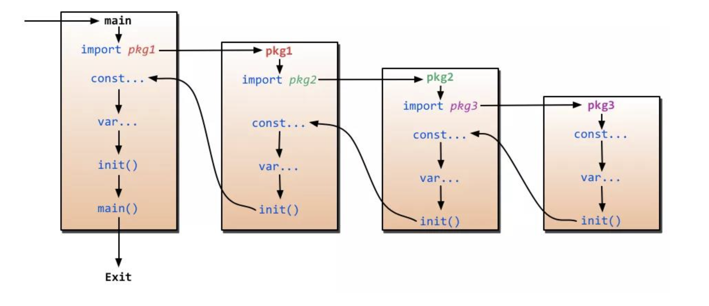

# Notes

## 1

1. init() 函数是用于程序执行前做包的初始化的函数，比如初始化包里的变量等
2. 一个包可以出线多个 init() 函数,一个源文件也可以包含多个 init() 函数
3. 同一个包中多个 init() 函数的执行顺序没有明确定义，但是不同包的 init 函数是根据包导入的依赖关系决定的（看下图）
4. init() 函数在代码中不能被显示调用、不能被引用（赋值给函数变量），否则出现编译错误
5. 一个包被引用多次，如 A import B,C import B,A import C，B 被引用多次，但 B 包只会初始化一次
6. 引入包，不可出现死循坏。即 A import B,B import A，这种情况编译失败



## 2

在 Go 语言中，cap() 函数用于返回一个切片、数组或通道的容量（capacity）。它是 Go 语言的内置函数之一。

适用范围:

1. 切片 (slice)
2. 数组 (array)
3. 通道 (channel)

## 3

这两种写法有显著区别，主要体现在 Go 语言中的嵌套类型（匿名字段）和普通字段的差异：

---

### **写法 1：**

```go
type Teacher struct {
    People
}
```

- **匿名字段嵌套：**

  - `People` 是匿名字段。
  - 这种情况下，`Teacher` 结构体**继承了 `People` 的字段和方法**。换句话说，可以直接通过 `Teacher` 的实例访问 `People` 的字段和方法，而不需要额外的字段名称前缀。
  - **示例：**

    ```go
    type People struct {
        Name string
        Age  int
    }

    type Teacher struct {
        People
    }

    func main() {
        t := Teacher{
            People: People{
                Name: "Alice",
                Age:  30,
            },
        }

        fmt.Println(t.Name) // 直接访问 People 的字段，输出: Alice
        fmt.Println(t.Age)  // 输出: 30
    }
    ```

- **方法绑定：**
  - 如果 `People` 类型有方法，这些方法会提升到 `Teacher`，也就是说，可以直接通过 `Teacher` 调用 `People` 的方法。

---

### **写法 2：**

```go
type Teacher struct {
    p People
}
```

- **普通字段嵌套：**

  - `p` 是 `Teacher` 的一个普通字段，类型为 `People`。
  - 在这种情况下，`People` 的字段和方法不会直接提升到 `Teacher`，访问时必须通过 `p` 字段。
  - **示例：**

    ```go
    type People struct {
        Name string
        Age  int
    }

    type Teacher struct {
        p People
    }

    func main() {
        t := Teacher{
            p: People{
                Name: "Alice",
                Age:  30,
            },
        }

        fmt.Println(t.p.Name) // 需要通过 p 字段访问，输出: Alice
        fmt.Println(t.p.Age)  // 输出: 30
    }
    ```

- **方法绑定：**
  - 如果 `People` 类型有方法，这些方法不会提升到 `Teacher`。
  - 只能通过 `t.p` 的形式调用 `People` 的方法。

---

### **总结对比：**

| 特性             | 写法 1 (`People`)          | 写法 2 (`p People`)          |
| ---------------- | -------------------------- | ---------------------------- |
| 字段访问方式     | 直接访问                   | 通过字段名称访问 (`t.p`)     |
| 方法提升         | 提升到 `Teacher`           | 不会提升                     |
| 嵌套类型是否匿名 | 是                         | 否                           |
| 适合场景         | 需要复用父类型的方法和字段 | 字段隔离或有多个相同类型嵌套 |

**选择依据：**

- 如果需要 `Teacher` 直接具有 `People` 的行为（字段和方法），使用匿名字段（写法 1）。
- 如果 `Teacher` 只是包含一个 `People` 的实例，而不希望暴露其所有字段和方法，使用普通字段（写法 2）。

## 4

### 下面代码输出什么？

```go
func main() {
    str := "hello"
    str[0] = 'x'
    fmt.Println(str)
}
```

A. hello

B. xello

C. compilation error

参考代码及解析：C。知识点：常量，Go 语言中的字符串是只读的。

### 下面代码输出什么？

```go
func incr(p *int) int {
    *p++
    return *p
}

func main() {
    p := 1
    incr(&p)
    fmt.Println(p)
}
```

A. 1

B. 2

C. 3

参考答案及解析：B。知识点：指针，incr() 函数里的 p 是 \*int 类型的指针，指向的是 main() 函数的变量 p 的地址。第 2 行代码是将该地址的值执行一个自增操作，incr() 返回自增后的结果。

### 对 add() 函数调用正确的是（）

```go
func add(args ...int) int {
    sum := 0
    for _, arg := range args {
        sum += arg
    }
    return sum
}
```

A. add(1, 2)

B. add(1, 3, 7)

C. add([]int{1, 2})

D. add([]int{1, 3, 7}…)

参考答案及解析：ABD。知识点：可变函数。

## 5

下面代码中，x 已声明，y 没有声明，判断每条语句的对错。

1. x, \_ := f()
2. x, \_ = f()
3. x, y := f()
4. x, y = f()

错、对、对、错。

1. 错，x 已经声明，不能使用 :=；
2. 对；
3. 对，当多值赋值时，:= 左边的变量无论声明与否都可以；
4. 错，y 没有声明。

## 6

于 switch 语句，下面说法正确的有?

A. 条件表达式必须为常量或者整数；

B. 单个 case 中，可以出现多个结果选项；

C. 需要用 break 来明确退出一个 case；

D. 只有在 case 中明确添加 fallthrough 关键字，才会继续执行紧跟的下一个 case；

在 Go 语言中，关于 `switch` 语句的说法如下：

1. **A. 条件表达式必须为常量或者整数；**  
   **错误**。  
   Go 中 `switch` 的条件表达式不局限于常量或整数，它可以是任意的值，包括字符串、布尔值等。甚至可以没有表达式，直接对每个 `case` 执行布尔条件判断。

2. **B. 单个 case 中，可以出现多个结果选项；**  
   **正确**。  
   一个 `case` 可以列出多个匹配选项，用逗号分隔。  
   例如：

   ```go
   switch day := "Monday"; day {
   case "Monday", "Tuesday":
       fmt.Println("Start of the week")
   case "Saturday", "Sunday":
       fmt.Println("Weekend")
   default:
       fmt.Println("Midweek")
   }
   ```

3. **C. 需要用 break 来明确退出一个 case；**  
   **错误**。  
   在 Go 中，`case` 默认会自动退出，无需显式使用 `break`。

4. **D. 只有在 case 中明确添加 fallthrough 关键字，才会继续执行紧跟的下一个 case；**  
   **正确**。  
   如果需要在匹配的 `case` 后继续执行下一个 `case`，需要使用 `fallthrough` 关键字。

补充：`fallthrough` 示例

```go
switch num := 2; num {
case 1:
    fmt.Println("One")
case 2:
    fmt.Println("Two")
    fallthrough
case 3:
    fmt.Println("Three")
default:
    fmt.Println("Other")
}
```

输出：

```
Two
Three
```

## 7

关于变量的自增和自减操作，下面语句正确的是？

A.
i := 1
i++

B.
i := 1
j = i++

C.
i := 1
++i

D.
i := 1
i--

AD。知识点：自增自减操作。i++ 和 i– 在 Go 语言中是语句，不是表达式，因此不能赋值给另外的变量。此外没有 ++i 和 -–i。

## 8

下面代码有什么问题？

```go
const i = 100
var j = 123

func main() {
    fmt.Println(&j, j)
    fmt.Println(&i, i)
}
```

编译报错 cannot take the address of i。知识点：常量。常量不同于变量的在运行期分配内存，常量通常会被编译器在预处理阶段直接展开，作为指令数据使用，所以常量无法寻址。

## 9

```go
func main()
{
    fmt.Println("hello world")
}
```

编译错误。

syntax error: unexpected semicolon or newline before {
Go 语言中，大括号不能放在单独的一行。

正确的代码如下：

```go
func main(){
    fmt.Println("hello world")
}
```

## 10

```go
func main() {
    m := make(map[string]int, 2)
    cap(m)
}
```

1. 使用 make 创建 map 变量时可以指定第二个参数，不过会被忽略。
2. cap() 函数适用于数组、数组指针、slice 和 channel，不适用于 map，可以使用 len() 返回 map 的元素个数。

## 11

```go
func main() {
    const x = 123
    const y = 1.23
    fmt.Println(x)
}
```

y 没有被使用，但不会报错。常量是一个简单值的标识符，在程序运行时，不会被修改的量。不像变量，常量未使用是能编译通过的
